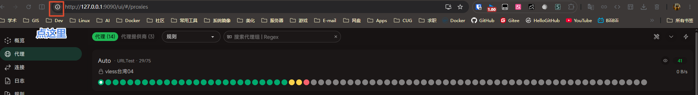

# Mihomo (Clash Meta) 代理配置

为 [mihomo](https://github.com/MetaCubeX/mihomo) 内核量身定制的全能代理配置文件，基于 TUN 模式实现全流量接管，附带精选 WebUI 面板和详细部署指南。

## 目录

- [项目概述](#项目概述)
- [技术栈](#技术栈)
- [功能特性](#功能特性)
- [文件说明](#文件说明)
- [快速开始](#快速开始)
  - [Linux 平台](#linux-平台)
  - [Windows 平台](#windows-平台)
- [配置文件详解](#配置文件详解)
  - [配置架构概览](#配置架构概览)
  - [全局配置](#全局配置)
  - [TUN 配置](#tun-配置)
  - [DNS 配置](#dns-配置)
  - [流量嗅探](#流量嗅探)
  - [代理组](#代理组)
  - [代理集合](#代理集合)
  - [规则集](#规则集)
  - [路由规则链](#路由规则链)
- [工作原理](#工作原理)
  - [TUN 模式流量接管](#tun-模式流量接管)
  - [Fake-IP DNS 解析](#fake-ip-dns-解析)
  - [规则匹配流程](#规则匹配流程)
- [自定义配置](#自定义配置)
  - [添加订阅源](#添加订阅源)
  - [自定义规则](#自定义规则)
  - [修改 DNS 设置](#修改-dns-设置)
- [故障排除](#故障排除)
  - [防火墙设置](#防火墙设置)
  - [Systemd 服务权限](#systemd-服务权限)
  - [内核转发](#内核转发)
  - [路由设置](#路由设置)
  - [常见问题](#常见问题)
- [许可证](#许可证)

---

## 项目概述

本项目提供一套生产级的 [mihomo](https://github.com/MetaCubeX/mihomo)（原 Clash Meta）代理配置方案，采用 TUN 模式实现系统级透明代理，无需为每个应用程序单独配置代理设置。配置集成了智能分流、Fake-IP DNS、流量嗅探、自动规则更新等高级功能，并针对 OpenAI、Claude、GitHub、Netflix 等常用服务提供独立代理组。

项目同时包含两个现代化的 WebUI 面板：
- **[metacubexd](https://github.com/MetaCubeX/metacubexd)** — 基于 Nuxt 开发的轻量面板
- **[zashboard](https://github.com/Zephyruso/zashboard)** — 基于 Vue 开发的现代化面板

## 技术栈

- **代理内核**：[mihomo](https://github.com/MetaCubeX/mihomo)（Clash Meta，Go 语言实现）
- **配置格式**：YAML
- **代理协议**：VMess / VLESS / Shadowsocks / Trojan / Hysteria2 / TUIC 等（由订阅提供）
- **路由模式**：Rule（规则路由）+ TUN（虚拟网卡）
- **DNS 模式**：Fake-IP + 分流
- **Geo 资源**：GeoIP / GeoSite / ASN（自动更新）
- **WebUI**：metacubexd（Nuxt）/ zashboard（Vue）
- **运行平台**：Linux（Arch Linux / systemd）、Windows

## 功能特性

- **TUN 全流量接管** — 无需逐个应用配置代理，系统全局透明代理
- **Fake-IP DNS** — 减少 DNS 查询延迟，提升访问速度
- **智能分流** — 国内外流量自动分离（直连/代理/拒绝）
- **精细化服务路由** — OpenAI / Claude / GitHub / Netflix / Disney+ / YouTube / Spotify / TikTok / Telegram / Twitter / Copilot / OneDrive 等独立代理组
- **流量嗅探** — 自动识别 TLS / HTTP / QUIC 流量，精准匹配域名规则
- **Proxy Provider** — 支持多订阅源自动更新，健康检查
- **Rule Provider** — 规则集远程自动更新（Loyalsoldier 规则）
- **Geo 数据自动更新** — GeoIP / GeoSite / ASN 每日自动同步
- **双 WebUI** — 同时提供 metacubexd 和 zashboard 两种面板

## 文件说明

```
Proxy/
├── config.yaml           # 主配置文件（生产用，已脱敏订阅链接）
├── metacubexd/           # WebUI 面板 - MetaCubeX/metacubexd
│   ├── index.html        # 面板入口
│   ├── _nuxt/            # Nuxt 构建产物
│   └── _fonts/           # 字体文件
├── zashboard/            # WebUI 面板 - Zephyruso/zashboard
│   ├── assets/           # 静态资源（字体、样式）
│   └── apple-touch-icon.png
├── scripts/              # 辅助脚本
│   └── windows/
│       └── mihomo.vbs    # Windows 后台运行脚本
├── assets/               # 文档资源
│   └── README/
│       └── 01.png        # 缓存清除示意图
├── .gitignore
├── LICENSE               # MIT License
└── README.md             # 本文件
```

下载链接：

- [mihomo 内核 - MetaCubeX/mihomo](https://github.com/MetaCubeX/mihomo)
- [Dashboard - Zephyruso/zashboard](https://github.com/Zephyruso/zashboard)
- [Dashboard - MetaCubeX/metacubexd](https://github.com/MetaCubeX/metacubexd)

---

## 快速开始

### Linux 平台

> 这里以 Arch Linux 为例。

#### 安装 mihomo

```bash
sudo pacman -S mihomo
```

> [!note]
> mihomo 只有在 [archlinuxcn](https://help.mirror.nju.edu.cn/archlinuxcn/) 源、[chaotic-aur](https://aur.chaotic.cx/) 源、aur 源中才有。没有网络代理的话，建议先添加 [archlinuxcn](https://help.mirror.nju.edu.cn/archlinuxcn/) 源后，再进行下载安装。

#### 配置 WebUI

WebUI 只是静态文件，你可以用本项目的 `ui` 目录，或者从 [GitHub MetaCubeX/metacubexd](https://github.com/MetaCubeX/metacubexd?tab=readme-ov-file) 下载。还可以通过 pacman 安装：`sudo pacman -S metacubexd-bin`（archlinuxcn 源和 aur 源才有 metacubexd）。

#### 启动服务

```bash
sudo systemctl enable --now mihomo.service
```

#### 部署配置和 UI

> 配置文件位置是 `/etc/mihomo/config.yaml` 或 `~/.config/mihomo/config.yaml`。一般是将 `config.yaml` 复制到 `/etc/mihomo/config.yaml` 下，而 `ui` 目录放在 `/var/lib/mihomo/` 目录下。

复制配置文件：

```bash
sudo cp config.yaml /etc/mihomo/config.yaml
```

> **重要**：务必在 `config.yaml` 的 `proxy-providers` 部分填入你的订阅链接。

复制 `ui` 文件（任选一个 dashboard 目录即可）：

```bash
sudo cp -r zashboard /var/lib/mihomo/ui
```

#### 重启服务

```bash
sudo systemctl restart mihomo.service
```

> 一般情况下，将配置文件和 `ui` 文件复制到相应目录后，再重启 mihomo.service 就能成功使用了。如果没有成功，继续看下文的问题解决部分。

#### 验证运行状态

```bash
# 查看服务状态
sudo systemctl status mihomo.service

# 查看日志
sudo journalctl -fu mihomo.service

# 查看 TUN 网卡是否创建
ip a show Meta
```

打开浏览器访问 `http://127.0.0.1:9090/ui` 进入 WebUI 管理面板。

#### 常用操作速查

| 命令 | 说明 |
|------|------|
| `sudo systemctl start mihomo` | 启动服务 |
| `sudo systemctl stop mihomo` | 停止服务 |
| `sudo systemctl restart mihomo` | 重启服务 |
| `sudo systemctl enable --now mihomo` | 开机自启并立即启动 |
| `sudo journalctl -fu mihomo` | 实时查看日志 |
| `sudo mihomo -t -d /etc/mihomo` | 测试配置是否正确 |
| `sudo mihomo -d /etc/mihomo` | 前台运行（调试用） |

---

### Windows 平台

#### 下载 mihomo 核心文件并解压

各个版本的区别：

1. **核心区别**：`v1`, `v2`, `v3`, `compatible`（CPU 微架构级别）

	Go 1.18+ 针对 x86-64 (amd64) 架构引入了 4 个微架构级别（v1-v4）。级别越高，利用的现代 CPU 新指令集（如 AVX, AVX2, FMA 等）就越多，理论上性能和内存效率越好，但对老旧 CPU 的兼容性越差。

	| 版本 | 要求指令集 | 适用 CPU |
	|------|-----------|---------|
	| `compatible` | 关闭几乎所有特定指令集优化 | 极其古老或非主流的 x86 处理器 |
	| `amd64` / `v1` | SSE/SSE2 | 过去 20 年内的所有 64 位 Intel/AMD CPU |
	| `v2` | SSE4.1、SSE4.2、POPCOUNT | Intel Nehalem（第一代 Core i3/i5/i7）及之后 |
	| `v3` | AVX、AVX2、BMI1、BMI2、FMA3 | Intel Haswell（第四代酷睿，2013 年）及之后，AMD Ryzen 全系列 |

	> [!tip] 简单来说
	> 如果你的电脑是近 10 年内买的，直接无脑选 **`v3`** 性能最好；如果不确定，选 **`v1`** 或不带 v 的标准版最稳妥。

2. **编译器区别**：`-go120`, `-go125`（Go 运行时版本）

	形如 `-go125` 的后缀，代表该可执行文件是用特定版本的 Go 语言编译器编译出来的（例如 `go1.25`）。

	- **带具体 Go 版本（如 `go125`）**：使用特定版本的 Go 编译，通常是为了照顾某些旧系统，或者特定的加密库、内核网络特性在旧版 Go 下更稳定。
	- **不带 Go 版本（如 `mihomo-windows-amd64-v3-v1.19.25.zip`）**：通常使用当前开发团队推荐的最新的、最稳定的主流 Go 版本编译。

	> [!tip] 建议
	> 优先选择 **不带 `-goXXX` 后缀** 的版本。因为它们使用的是官方 CI/CD 默认的主流稳定 Go 环境，通常也包含了最新的安全补丁和运行时优化。

3. **架构区别**：`amd64` vs `arm64`

	- **`amd64`**：适用于绝大多数传统的 Intel 或 AMD 处理器的 Windows 电脑。
	- **`arm64`**：适用于采用 ARM 架构芯片的 Windows 设备，例如搭载高通 Snapdragon X Elite / 8cx 的掌上设备或轻薄本（如 Surface Pro 11 / Copilot+ PC）。

> [!abstract] 选型指南（懒人包）
>
> 1. **绝大多数近年的主流 PC / 笔记本（Intel/AMD 处理器）**：下载 **`mihomo-windows-amd64-v3-<版本号>.zip`**（性能最佳且稳定）
> 2. **比较老的电脑（2013 年以前的旧设备）**：下载 **`mihomo-windows-amd64-v1-<版本号>.zip`**（或直接不带 v 的版本）
> 3. **Surface Pro 11、Mac 虚拟机（运行 Windows ARM）或高通芯片轻薄本**：下载 **`mihomo-windows-arm64-<版本号>.zip`**

#### 裸核运行脚本

在核心同级目录下创建 `mihomo.vbs` 文件：

```vb
set mihomo = CreateObject("WScript.Shell")
mihomo.Run "mihomo-windows-amd64.exe -d .", 0
```

> [!note] 说明
> `.vbs` 脚本的作用是以无窗口方式后台运行 mihomo 内核，避免出现命令行黑窗口。

#### 创建配置文件

在核心同级目录下创建 `config.yaml` 文件，该文件可以使用当前仓库中的 `config.yaml`，然后把 WebUI 目录放到与 `config.yaml` 同层级目录下。

#### 运行核心

运行 `mihomo.vbs` 文件，在浏览器访问 [http://localhost:9090/ui](http://localhost:9090/ui) 进入控制面板。

#### 开机启动

为 `mihomo.vbs` 文件创建快捷方式，置于以下目录：

- **所有用户的开机自启**（需要管理员权限）：

```
C:\ProgramData\Microsoft\Windows\Start Menu\Programs\Startup
```

- **当前用户的开机自启**：

按住 `Win + R`，输入 `shell:startup`，再按 `Enter` 打开。

```
C:\Users\<用户名>\AppData\Roaming\Microsoft\Windows\Start Menu\Programs\Startup
```

---

## 配置文件详解

### 配置架构概览

```yaml
# 主配置结构
config.yaml
├── 全局配置（端口/模式/日志）
├── TUN 配置（虚拟网卡/路由/DNS 劫持）
├── DNS 配置（Fake-IP/分流/上游 DNS）
├── 流量嗅探（TLS/HTTP/QUIC）
├── 代理组（Auto / PROXY / OpenAI / Claude / ...）
├── 代理集合（Proxy Providers 订阅源）
├── 规则集（Rule Providers）
└── 规则（路由规则链）
```

### 全局配置

| 参数 | 值 | 说明 |
|------|-----|------|
| `mixed-port` | 7890 | 混合代理端口（HTTP + SOCKS5） |
| `socks-port` | 7891 | SOCKS5 代理端口 |
| `allow-lan` | true | 允许局域网访问 |
| `mode` | rule | 规则路由模式 |
| `external-controller` | 127.0.0.1:9090 | WebUI API 地址 |
| `external-ui` | ./ui | WebUI 静态文件路径 |
| `log-level` | info | 日志级别 |
| `ipv6` | true | 启用 IPv6 |
| `tcp-concurrent` | true | TCP 并发 |
| `unified-delay` | true | 统一延迟显示 |
| `geo-auto-update` | true | Geo 数据自动更新 |
| `geo-update-interval` | 24 | Geo 数据更新间隔（小时） |

### TUN 配置

TUN 模式创建一个虚拟网卡，所有系统流量都会经过 mihomo：

```yaml
tun:
  enable: true          # 启用 TUN
  device: Meta          # 虚拟网卡名称
  stack: mixed          # 网络栈：system/gvisor/mixed
  dns-hijack:           # 劫持 DNS 查询
    - any:53
  auto-route: true      # 自动设置全局路由
  auto-detect-interface: true  # 自动识别出站网卡
  endpoint-independent-nat: true  # 端点独立 NAT
```

**网络栈模式说明**：

| 模式 | 说明 | 适用场景 |
|------|------|----------|
| `system` | 使用操作系统原生网络栈 | 性能最好，兼容性一般 |
| `gvisor` | 使用用户态网络栈 | 兼容性最好，性能略低 |
| `mixed` | 自动选择 system/gvisor | 推荐，平衡性能与兼容性 |

### DNS 配置

Fake-IP 模式为每个域名分配一个假的 IP 地址（198.18.0.0/16 段），避免真实 DNS 查询延迟。mihomo 会拦截对这些假 IP 的访问并匹配规则。

```yaml
dns:
  enable: true
  enhanced-mode: fake-ip      # Fake-IP 模式
  fake-ip-range: 198.18.0.1/16  # Fake-IP 地址池
  listen: ":53"               # DNS 监听端口

  default-nameserver:         # 用于解析 DoH/DoT 的纯 IP DNS
    - 114.114.114.114
    - 223.5.5.5
    - 8.8.8.8

  nameserver:                 # 主要 DNS 服务器
    - 114.114.114.114
    - tls://223.5.5.5:853
    - https://doh.pub/dns-query

  fallback:                   #  fallback DNS（用于解析境外域名）
    - 8.8.8.8
    - 1.1.1.1

  fallback-filter:            # fallback 触发条件
    geoip: true
    geoip-code: CN
    geosite:
      - gfw
```

**DNS 查询流程**：

```
用户请求 example.com
      ↓
mihomo 返回 fake-ip（198.18.x.x）
      ↓
用户发起对 198.18.x.x 的连接
      ↓
mihomo 根据域名规则选择代理/直连
      ↓
代理节点发起真实 DNS 查询 → 建立连接
```

### 流量嗅探

流量嗅探是 TUN 模式下识别域名的关键机制。由于 TUN 模式工作在 IP 层，原始请求只包含 IP 地址，嗅探器通过分析 TLS SNI、HTTP Host 等字段恢复域名信息：

```yaml
sniffer:
  enable: true
  sniff:
    TLS:
      ports: [443, 8443]           # 嗅探 TLS SNI
    HTTP:
      ports: [80, 8080-8880]
      override-destination: true    # 覆盖目标地址
    QUIC:
      ports: [443, 8443]           # 嗅探 QUIC 流量
  force-domain:                    # 强制嗅探的域名
    - "+.claude.ai"
    - "+.openai.com"
  skip-domain:                     # 跳过嗅探的域名
    - "*.apple.com"
```

### 代理组

| 代理组 | 类型 | 说明 |
|--------|------|------|
| `Auto` | url-test | 自动选择延迟最低的节点 |
| `PROXY` | select | 手动选择代理节点 |
| `OpenAI` | select | ChatGPT / OpenAI API |
| `Claude` | select | Claude AI |
| `GitHub` | select | GitHub 系列服务 |
| `Netflix` | select | Netflix 流媒体 |
| `Disney` | select | Disney+ 流媒体 |
| `Youtube` | select | YouTube |
| `Spotify` | select | Spotify |
| `Tiktok` | select | TikTok |
| `Telegram` | select | Telegram |
| `Twitter` | select | Twitter/X |
| `Copilot` | select | Microsoft Copilot / Bing AI |
| `OneDrive` | select | Microsoft OneDrive |

### 代理集合

代理集合（Proxy Providers）支持从远程订阅链接自动获取节点：

```yaml
proxy-providers:
  provider1:
    type: http
    url: "填入你的代理链接"
    path: ./proxy_providers/provider1.yaml
    interval: 86400               # 自动更新间隔（秒）
    health-check:
      enable: true
      interval: 600
      timeout: 5000
      url: https://www.gstatic.com/generate_204
```

### 规则集

规则集（Rule Providers）支持从远程自动更新规则：

| 规则集 | 类型 | 说明 |
|--------|------|------|
| `lancidr` | ipcidr | 局域网 IP 段 |
| `private` | domain | 私有域名 |
| `direct` | domain | 直连域名 |
| `applications` | classical | 应用程序规则 |
| `icloud` | domain | iCloud 域名 |
| `apple` | domain | Apple 服务域名 |
| `cncidr` | ipcidr | 中国 IP 段 |
| `gfw` | domain | GFW 列表 |

### 路由规则链

规则按顺序匹配，命中即终止：

```
1. 应用程序直连（RULE-SET applications → DIRECT）
2. 内网/私有地址（RULE-SET private → DIRECT）
3. iCloud/Apple 服务（DIRECT）
4. 中国 CDN/游戏（GEOSITE cn → DIRECT）
5. 特定域名直连（mirrors.tuna, chat.qwen.ai 等 → DIRECT）
6. Claude / GitHub / Copilot → 对应代理组
7. OpenAI / Netflix / YouTube / Telegram 等 → 对应代理组
8. GFW 列表 → PROXY
9. 国内 IP → DIRECT
10. 其余流量 → PROXY（白名单模式）
```

---

## 工作原理

### TUN 模式流量接管

TUN 模式通过创建虚拟网卡（本配置中为 `Meta`）接管系统所有流量：

```
┌─────────────────────────────────────────────────────────────┐
│                        应用程序                             │
│                   (浏览器、游戏、工具等)                    │
└──────────────────────┬──────────────────────────────────────┘
                       │ 系统网络请求
                       ▼
┌─────────────────────────────────────────────────────────────┐
│                    TUN 虚拟网卡 (Meta)                      │
│              由 mihomo 创建，接管所有流量                   │
└──────────────────────┬──────────────────────────────────────┘
                       │ IP 数据包
                       ▼
┌─────────────────────────────────────────────────────────────┐
│                    mihomo 内核处理                          │
│  1. 流量嗅探（恢复域名信息）                                │
│  2. DNS 解析（Fake-IP 映射）                                │
│  3. 规则匹配（选择代理/直连）                               │
│  4. 代理协议封装（VMess/VLESS 等）                          │
└──────────────────────┬──────────────────────────────────────┘
                       │ 代理流量
                       ▼
┌─────────────────────────────────────────────────────────────┐
│                    代理服务器                               │
│              订阅提供的节点，转发到目标地址                 │
└─────────────────────────────────────────────────────────────┘
```

### Fake-IP DNS 解析

Fake-IP 是 TUN 模式的核心优化机制：

**传统 DNS 流程的问题**：
- 每个域名解析需要等待真实的 DNS 往返
- DNS 查询可能被污染或拦截
- 代理节点和本地使用同一套 DNS，难以分流

**Fake-IP 的解决方案**：
1. mihomo 维护一个本地 Fake-IP 池（198.18.0.0/16）
2. 当应用请求解析域名时，mihomo 立即返回一个 Fake-IP
3. 应用向 Fake-IP 发起连接
4. mihomo 根据 Fake-IP 查表获得真实域名
5. 根据规则决定直连（使用本地 DNS）或代理（通过远程节点解析）

**优势**：
- 零延迟 DNS 响应
- 避免 DNS 污染
- 实现精细化的 DNS 分流

### 规则匹配流程

```
用户访问 https://www.youtube.com
           │
           ▼
    TUN 网卡拦截连接
           │
           ▼
    流量嗅探识别域名 (youtube.com)
           │
           ▼
    DNS 查询 → 返回 Fake-IP
           │
           ▼
    规则链顺序匹配：
    ├─ applications? → 否
    ├─ private? → 否
    ├─ apple? → 否
    ├─ cn? → 否
    ├─ Claude? → 否
    ├─ GitHub? → 否
    ├─ Copilot? → 否
    ├─ OpenAI? → 否
    ├─ Netflix? → 否
    ├─ Disney? → 否
    ├─ Youtube? → 是 → 使用 Youtube 代理组
           │
           ▼
    代理组选择节点 → 建立连接
```

---

## 自定义配置

### 添加订阅源

在 `proxy-providers:` 部分添加新的机场订阅：

```yaml
proxy-providers:
  my_provider:                          # 自定义名称
    type: http
    url: "你的订阅链接"
    path: ./proxy_providers/my_provider.yaml
    interval: 86400                     # 自动更新间隔（秒）
    health-check:
      enable: true
      interval: 600
      timeout: 5000
      url: https://www.gstatic.com/generate_204
```

然后在 `proxy-groups` 中引用：

```yaml
proxy-groups:
  - name: "PROXY"
    type: select
    use:
      - my_provider
```

### 自定义规则

在 `rules:` 部分添加新规则：

```yaml
rules:
  # 格式：规则类型,匹配条件,策略组
  - DOMAIN-SUFFIX,example.com,PROXY    # 域名后缀匹配
  - DOMAIN-KEYWORD,example,PROXY       # 域名关键词匹配
  - DOMAIN,example.com,PROXY            # 精确域名匹配
  - GEOSITE,youtube,Youtube             # GeoSite 类别匹配
  - GEOIP,CN,DIRECT                     # IP 地理位置匹配
  - MATCH,PROXY                         # 兜底规则
```

**规则类型说明**：

| 类型 | 说明 | 示例 |
|------|------|------|
| `DOMAIN` | 精确域名匹配 | `DOMAIN,google.com,PROXY` |
| `DOMAIN-SUFFIX` | 后缀匹配 | `DOMAIN-SUFFIX,google.com,PROXY` 匹配 www.google.com |
| `DOMAIN-KEYWORD` | 关键词匹配 | `DOMAIN-KEYWORD,google,PROXY` |
| `GEOSITE` | GeoSite 类别 | `GEOSITE,youtube,Youtube` |
| `GEOIP` | GeoIP 国家/地区 | `GEOIP,CN,DIRECT` |
| `IP-CIDR` | IP 段匹配 | `IP-CIDR,127.0.0.0/8,DIRECT` |
| `RULE-SET` | 规则集引用 | `RULE-SET,gfw,PROXY` |
| `MATCH` | 兜底匹配 | `MATCH,PROXY` |

### 修改 DNS 设置

**切换为真实 IP 模式**（不推荐，仅用于调试）：

```yaml
dns:
  enhanced-mode: redir-host  # 将 fake-ip 改为 redir-host
```

**修改上游 DNS**：

```yaml
dns:
  nameserver:
    - 223.5.5.5              # 阿里 DNS
    - 119.29.29.29           # 腾讯 DNS
    - https://doh.pub/dns-query
```

**添加自定义 Fake-IP 过滤**：

```yaml
dns:
  fake-ip-filter:
    - "*.example.com"        # 该域名返回真实 IP
```

---

## 故障排除

### 防火墙设置

如果你使用了防火墙（如 `firewalld`），需要手动放行 TUN 网卡：

> 下面提到的 Meta 是你开启 TUN 模式创建的虚拟网卡，通过指令 `ip a` 查看。

- **Firewalld**:

```bash
sudo firewall-cmd --permanent --zone=trusted --add-interface=Meta
sudo firewall-cmd --reload
```

- **UFW**:

```bash
sudo ufw allow in on Meta
```

### Systemd 服务权限

#### 方式一（推荐）

如果通过 `pacman` 安装，通常自带了 service 文件，你可以使用 systemd 自带的交互式命令创建覆盖配置：

```bash
sudo systemctl edit mihomo
```

在打开的编辑器中，输入以下内容：

```ini
[Service]
# 如果你想以 root 运行以避开所有权限烦恼，取消下面两行的注释
# User=root
# Group=root

# 为 TUN 模式和 53 端口添加权限（针对非 root 用户）
AmbientCapabilities=CAP_NET_BIND_SERVICE CAP_NET_ADMIN
CapabilityBoundingSet=CAP_NET_BIND_SERVICE CAP_NET_ADMIN

# 如果你想指定特定的配置文件路径
# ExecStart=
# ExecStart=/usr/bin/mihomo -d /etc/mihomo
```

> **注意**：如果你要覆盖 `ExecStart` 这种带有命令的参数，必须先写一行空的 `ExecStart=` 来清除旧指令，然后再写一行新的。

保存退出编辑器并重启服务：

```bash
sudo systemctl restart mihomo
```

查看最终合并后的配置：

```bash
systemctl cat mihomo
```

#### 方式二

编辑（或创建）服务文件 `/etc/systemd/system/mihomo.service`：

```ini
[Unit]
Description=Mihomo Daemon
After=network.target

[Service]
Type=simple
User=your-user-name
Group=your-group-name
ExecStart=/usr/bin/mihomo -d /etc/mihomo
Restart=always

AmbientCapabilities=CAP_NET_BIND_SERVICE CAP_NET_ADMIN
CapabilityBoundingSet=CAP_NET_BIND_SERVICE CAP_NET_ADMIN

[Install]
WantedBy=multi-user.target
```

> 不推荐该方式，更新 mihomo 后可能会导致配置失效。

### 内核转发

创建文件 `/etc/sysctl.d/99-ip-forward.conf`：

```conf
net.ipv4.ip_forward = 1
# 如果需要 IPv6
net.ipv6.conf.all.forwarding = 1
```

然后执行 `sudo sysctl --system` 生效。

### 路由设置

创建文件 `/etc/sysctl.d/99-rp-filter.conf`：

```conf
net.ipv4.conf.all.rp_filter = 2
net.ipv4.conf.default.rp_filter = 2
# 针对 config.yaml 中设置的 tun 接口（Meta）
net.ipv4.conf.Meta.rp_filter = 2
```

### 检查配置是否正确

```bash
sudo mihomo -t -d /etc/mihomo
```

如果输出 `configuration file test passed`，则配置无误。

### 常见问题

**Q: WebUI 无法访问**

检查 `external-controller` 和 `external-ui` 配置，确认 UI 文件路径正确。

**Q: WebUI 访问不一致，比如用的 zashboard，在浏览器中输入 `127.0.0.1:9090/ui` 显示的却是 metacubexd**

请打开你的 config.yaml 配置文件，找到 external-ui 相关的控制块（通常在配置文件的最顶部几行），按照以下规范进行修改：

```yaml
# 1. 指定本地存放 WebUI 面板的文件夹名称（你可以自定义，例如叫 ui 或者是 zashboard）
external-ui: ui

# 2. 【核心】将下载地址显式指定为 zashboard 的最新打包发布地址
# 推荐使用 dist-cdn-fonts.zip，这个版本去除了本地大字体文件，加载和下载速度极快
external-ui-url: "https://github.com/Zephyruso/zashboard/releases/latest/download/dist-cdn-fonts.zip"
```

修改完成后的操作：

1. 保存配置文件。
2. 彻底关闭并重启你的 mihomo 裸核（如果是在 Linux/OpenWrt 上，使用 systemctl restart mihomo 或者是软路由后台重启插件）。
3. 关键一步：由于浏览器会深度缓存前端样式，请在浏览器中按下 Ctrl + Shift + Delete，清除该端口（如 127.0.0.1:9090）的所有缓存和站点数据。
4. 换个无痕模式（隐身窗口）再次打开，看看是否恢复成了 Zashboard UI。

对于第三步中，可以点击图示中的按钮：



再点击“网站设置” -> “删除数据” -> “按住 ctrl + 点击刷新按钮”即可。

**Q: TUN 网卡没有创建**

检查 systemd 权限配置，确保有 `CAP_NET_ADMIN`。查看日志：`sudo journalctl -fu mihomo.service`。

**Q: DNS 解析异常**

检查 `default-nameserver` 是否配置了可用的 DNS 服务器。Fake-IP 模式下 `default-nameserver` 必须使用纯 IP 而非 DoH/DoT。

**Q: 代理节点连接失败**

确认订阅链接是否有效，执行 `sudo mihomo -d /etc/mihomo` 前台运行查看具体错误日志。

---

## 许可证

[MIT](LICENSE) © 2025 loskyertt
